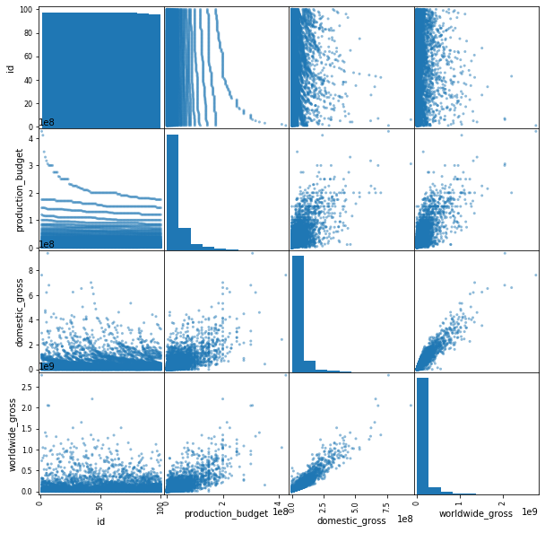

## Final Project Submission

Please fill out:
* Student name: Raffette Alston
* Student pace: Part-time
* Scheduled project review date/time: 
* Instructor name: James Irving, PhD
* Blog post URL:


# Introduction
Microsoft sees all the big companies creating original video content, and they want to get in on the fun. They have decided to create a new movie studio, but the problem is they don’t know anything about creating movies. They have hired you to help them better understand the movie industry. Your team is charged with doing data analysis and creating a presentation that explores what type of films are currently doing the best at the box office. You must then translate those findings into actionable insights that the CEO can use when deciding what type of films they should be creating. 


### Questions to Ask
- Which movie genres grossed the most domestically and internationally between 1975-2018?
- Which genres are most popular between 1975-2018?
- Which studios produced the movies with the highest gross between 1975-2018?
- Which directors and producers were involved in the movies with the highest gross between 1975-2018?


# Import Libraries and Data


```python
%ls
```

    CONTRIBUTING.md             module1_project_rubric.pdf
    LICENSE.md                  student.ipynb
    README.md                   zippedData/
    awesome.gif


```python
import os
os.listdir("zippedData/")
```


    ['imdb.title.crew.csv.gz',
     'tmdb.movies.csv.gz',
     'imdb.title.akas.csv.gz',
     'imdb.title.ratings.csv.gz',
     'imdb.name.basics.csv.gz',
     'rt.reviews.tsv.gz',
     'imdb.title.basics.csv.gz',
     'rt.movie_info.tsv.gz',
     'tn.movie_budgets.csv.gz',
     'bom.movie_gross.csv.gz',
     'imdb.title.principals.csv.gz']


```python
import glob
file_list = glob.glob("zippedData/*")
file_list
```


    ['zippedData/imdb.title.crew.csv.gz',
     'zippedData/tmdb.movies.csv.gz',
     'zippedData/imdb.title.akas.csv.gz',
     'zippedData/imdb.title.ratings.csv.gz',
     'zippedData/imdb.name.basics.csv.gz',
     'zippedData/rt.reviews.tsv.gz',
     'zippedData/imdb.title.basics.csv.gz',
     'zippedData/rt.movie_info.tsv.gz',
     'zippedData/tn.movie_budgets.csv.gz',
     'zippedData/bom.movie_gross.csv.gz',
     'zippedData/imdb.title.principals.csv.gz']


```python
import numpy as np
import matplotlib.pyplot as plt
import seaborn as sns
import pandas as pd
```


```python
DATA = {}
for file in file_list:
    key = file.split('/')[-1]
    print(key)
    
    try:
        df = pd.read_csv(file)
    except:
        df = pd.read_csv(file, sep='\t',encoding='latin-1')
    
    DATA[key] = df
```

    imdb.title.crew.csv.gz
    tmdb.movies.csv.gz
    imdb.title.akas.csv.gz
    imdb.title.ratings.csv.gz
    imdb.name.basics.csv.gz
    rt.reviews.tsv.gz
    imdb.title.basics.csv.gz
    rt.movie_info.tsv.gz
    tn.movie_budgets.csv.gz
    bom.movie_gross.csv.gz
    imdb.title.principals.csv.gz


```python
for filename, df in DATA.items():
    print(filename)
    display(df.head())
    print()
```

    imdb.title.crew.csv.gz


<div>
<style scoped>
    .dataframe tbody tr th:only-of-type {
        vertical-align: middle;
    }

    .dataframe tbody tr th {
        vertical-align: top;
    }

    .dataframe thead th {
        text-align: right;
    }
</style>
<table border="1" class="dataframe">
  <thead>
    <tr style="text-align: right;">
      <th></th>
      <th>tconst</th>
      <th>directors</th>
      <th>writers</th>
    </tr>
  </thead>
  <tbody>
    <tr>
      <td>0</td>
      <td>tt0285252</td>
      <td>nm0899854</td>
      <td>nm0899854</td>
    </tr>
    <tr>
      <td>1</td>
      <td>tt0438973</td>
      <td>NaN</td>
      <td>nm0175726,nm1802864</td>
    </tr>
    <tr>
      <td>2</td>
      <td>tt0462036</td>
      <td>nm1940585</td>
      <td>nm1940585</td>
    </tr>
    <tr>
      <td>3</td>
      <td>tt0835418</td>
      <td>nm0151540</td>
      <td>nm0310087,nm0841532</td>
    </tr>
    <tr>
      <td>4</td>
      <td>tt0878654</td>
      <td>nm0089502,nm2291498,nm2292011</td>
      <td>nm0284943</td>
    </tr>
  </tbody>
</table>
</div>


    
    tmdb.movies.csv.gz


<div>
<style scoped>
    .dataframe tbody tr th:only-of-type {
        vertical-align: middle;
    }

    .dataframe tbody tr th {
        vertical-align: top;
    }

    .dataframe thead th {
        text-align: right;
    }
</style>
<table border="1" class="dataframe">
  <thead>
    <tr style="text-align: right;">
      <th></th>
      <th>Unnamed: 0</th>
      <th>genre_ids</th>
      <th>id</th>
      <th>original_language</th>
      <th>original_title</th>
      <th>popularity</th>
      <th>release_date</th>
      <th>title</th>
      <th>vote_average</th>
      <th>vote_count</th>
    </tr>
  </thead>
  <tbody>
    <tr>
      <td>0</td>
      <td>0</td>
      <td>[12, 14, 10751]</td>
      <td>12444</td>
      <td>en</td>
      <td>Harry Potter and the Deathly Hallows: Part 1</td>
      <td>33.533</td>
      <td>2010-11-19</td>
      <td>Harry Potter and the Deathly Hallows: Part 1</td>
      <td>7.7</td>
      <td>10788</td>
    </tr>
    <tr>
      <td>1</td>
      <td>1</td>
      <td>[14, 12, 16, 10751]</td>
      <td>10191</td>
      <td>en</td>
      <td>How to Train Your Dragon</td>
      <td>28.734</td>
      <td>2010-03-26</td>
      <td>How to Train Your Dragon</td>
      <td>7.7</td>
      <td>7610</td>
    </tr>
    <tr>
      <td>2</td>
      <td>2</td>
      <td>[12, 28, 878]</td>
      <td>10138</td>
      <td>en</td>
      <td>Iron Man 2</td>
      <td>28.515</td>
      <td>2010-05-07</td>
      <td>Iron Man 2</td>
      <td>6.8</td>
      <td>12368</td>
    </tr>
    <tr>
      <td>3</td>
      <td>3</td>
      <td>[16, 35, 10751]</td>
      <td>862</td>
      <td>en</td>
      <td>Toy Story</td>
      <td>28.005</td>
      <td>1995-11-22</td>
      <td>Toy Story</td>
      <td>7.9</td>
      <td>10174</td>
    </tr>
    <tr>
      <td>4</td>
      <td>4</td>
      <td>[28, 878, 12]</td>
      <td>27205</td>
      <td>en</td>
      <td>Inception</td>
      <td>27.920</td>
      <td>2010-07-16</td>
      <td>Inception</td>
      <td>8.3</td>
      <td>22186</td>
    </tr>
  </tbody>
</table>
</div>


    
    imdb.title.akas.csv.gz


<div>
<style scoped>
    .dataframe tbody tr th:only-of-type {
        vertical-align: middle;
    }

    .dataframe tbody tr th {
        vertical-align: top;
    }

    .dataframe thead th {
        text-align: right;
    }
</style>
<table border="1" class="dataframe">
  <thead>
    <tr style="text-align: right;">
      <th></th>
      <th>title_id</th>
      <th>ordering</th>
      <th>title</th>
      <th>region</th>
      <th>language</th>
      <th>types</th>
      <th>attributes</th>
      <th>is_original_title</th>
    </tr>
  </thead>
  <tbody>
    <tr>
      <td>0</td>
      <td>tt0369610</td>
      <td>10</td>
      <td>Джурасик свят</td>
      <td>BG</td>
      <td>bg</td>
      <td>NaN</td>
      <td>NaN</td>
      <td>0.0</td>
    </tr>
    <tr>
      <td>1</td>
      <td>tt0369610</td>
      <td>11</td>
      <td>Jurashikku warudo</td>
      <td>JP</td>
      <td>NaN</td>
      <td>imdbDisplay</td>
      <td>NaN</td>
      <td>0.0</td>
    </tr>
    <tr>
      <td>2</td>
      <td>tt0369610</td>
      <td>12</td>
      <td>Jurassic World: O Mundo dos Dinossauros</td>
      <td>BR</td>
      <td>NaN</td>
      <td>imdbDisplay</td>
      <td>NaN</td>
      <td>0.0</td>
    </tr>
    <tr>
      <td>3</td>
      <td>tt0369610</td>
      <td>13</td>
      <td>O Mundo dos Dinossauros</td>
      <td>BR</td>
      <td>NaN</td>
      <td>NaN</td>
      <td>short title</td>
      <td>0.0</td>
    </tr>
    <tr>
      <td>4</td>
      <td>tt0369610</td>
      <td>14</td>
      <td>Jurassic World</td>
      <td>FR</td>
      <td>NaN</td>
      <td>imdbDisplay</td>
      <td>NaN</td>
      <td>0.0</td>
    </tr>
  </tbody>
</table>
</div>


    
    imdb.title.ratings.csv.gz


<div>
<style scoped>
    .dataframe tbody tr th:only-of-type {
        vertical-align: middle;
    }

    .dataframe tbody tr th {
        vertical-align: top;
    }

    .dataframe thead th {
        text-align: right;
    }
</style>
<table border="1" class="dataframe">
  <thead>
    <tr style="text-align: right;">
      <th></th>
      <th>tconst</th>
      <th>averagerating</th>
      <th>numvotes</th>
    </tr>
  </thead>
  <tbody>
    <tr>
      <td>0</td>
      <td>tt10356526</td>
      <td>8.3</td>
      <td>31</td>
    </tr>
    <tr>
      <td>1</td>
      <td>tt10384606</td>
      <td>8.9</td>
      <td>559</td>
    </tr>
    <tr>
      <td>2</td>
      <td>tt1042974</td>
      <td>6.4</td>
      <td>20</td>
    </tr>
    <tr>
      <td>3</td>
      <td>tt1043726</td>
      <td>4.2</td>
      <td>50352</td>
    </tr>
    <tr>
      <td>4</td>
      <td>tt1060240</td>
      <td>6.5</td>
      <td>21</td>
    </tr>
  </tbody>
</table>
</div>


    
    imdb.name.basics.csv.gz


<div>
<style scoped>
    .dataframe tbody tr th:only-of-type {
        vertical-align: middle;
    }

    .dataframe tbody tr th {
        vertical-align: top;
    }

    .dataframe thead th {
        text-align: right;
    }
</style>
<table border="1" class="dataframe">
  <thead>
    <tr style="text-align: right;">
      <th></th>
      <th>nconst</th>
      <th>primary_name</th>
      <th>birth_year</th>
      <th>death_year</th>
      <th>primary_profession</th>
      <th>known_for_titles</th>
    </tr>
  </thead>
  <tbody>
    <tr>
      <td>0</td>
      <td>nm0061671</td>
      <td>Mary Ellen Bauder</td>
      <td>NaN</td>
      <td>NaN</td>
      <td>miscellaneous,production_manager,producer</td>
      <td>tt0837562,tt2398241,tt0844471,tt0118553</td>
    </tr>
    <tr>
      <td>1</td>
      <td>nm0061865</td>
      <td>Joseph Bauer</td>
      <td>NaN</td>
      <td>NaN</td>
      <td>composer,music_department,sound_department</td>
      <td>tt0896534,tt6791238,tt0287072,tt1682940</td>
    </tr>
    <tr>
      <td>2</td>
      <td>nm0062070</td>
      <td>Bruce Baum</td>
      <td>NaN</td>
      <td>NaN</td>
      <td>miscellaneous,actor,writer</td>
      <td>tt1470654,tt0363631,tt0104030,tt0102898</td>
    </tr>
    <tr>
      <td>3</td>
      <td>nm0062195</td>
      <td>Axel Baumann</td>
      <td>NaN</td>
      <td>NaN</td>
      <td>camera_department,cinematographer,art_department</td>
      <td>tt0114371,tt2004304,tt1618448,tt1224387</td>
    </tr>
    <tr>
      <td>4</td>
      <td>nm0062798</td>
      <td>Pete Baxter</td>
      <td>NaN</td>
      <td>NaN</td>
      <td>production_designer,art_department,set_decorator</td>
      <td>tt0452644,tt0452692,tt3458030,tt2178256</td>
    </tr>
  </tbody>
</table>
</div>


    
    rt.reviews.tsv.gz


<div>
<style scoped>
    .dataframe tbody tr th:only-of-type {
        vertical-align: middle;
    }

    .dataframe tbody tr th {
        vertical-align: top;
    }

    .dataframe thead th {
        text-align: right;
    }
</style>
<table border="1" class="dataframe">
  <thead>
    <tr style="text-align: right;">
      <th></th>
      <th>id</th>
      <th>review</th>
      <th>rating</th>
      <th>fresh</th>
      <th>critic</th>
      <th>top_critic</th>
      <th>publisher</th>
      <th>date</th>
    </tr>
  </thead>
  <tbody>
    <tr>
      <td>0</td>
      <td>3</td>
      <td>A distinctly gallows take on contemporary fina...</td>
      <td>3/5</td>
      <td>fresh</td>
      <td>PJ Nabarro</td>
      <td>0</td>
      <td>Patrick Nabarro</td>
      <td>November 10, 2018</td>
    </tr>
    <tr>
      <td>1</td>
      <td>3</td>
      <td>It's an allegory in search of a meaning that n...</td>
      <td>NaN</td>
      <td>rotten</td>
      <td>Annalee Newitz</td>
      <td>0</td>
      <td>io9.com</td>
      <td>May 23, 2018</td>
    </tr>
    <tr>
      <td>2</td>
      <td>3</td>
      <td>... life lived in a bubble in financial dealin...</td>
      <td>NaN</td>
      <td>fresh</td>
      <td>Sean Axmaker</td>
      <td>0</td>
      <td>Stream on Demand</td>
      <td>January 4, 2018</td>
    </tr>
    <tr>
      <td>3</td>
      <td>3</td>
      <td>Continuing along a line introduced in last yea...</td>
      <td>NaN</td>
      <td>fresh</td>
      <td>Daniel Kasman</td>
      <td>0</td>
      <td>MUBI</td>
      <td>November 16, 2017</td>
    </tr>
    <tr>
      <td>4</td>
      <td>3</td>
      <td>... a perverse twist on neorealism...</td>
      <td>NaN</td>
      <td>fresh</td>
      <td>NaN</td>
      <td>0</td>
      <td>Cinema Scope</td>
      <td>October 12, 2017</td>
    </tr>
  </tbody>
</table>
</div>


    
    imdb.title.basics.csv.gz


<div>
<style scoped>
    .dataframe tbody tr th:only-of-type {
        vertical-align: middle;
    }

    .dataframe tbody tr th {
        vertical-align: top;
    }

    .dataframe thead th {
        text-align: right;
    }
</style>
<table border="1" class="dataframe">
  <thead>
    <tr style="text-align: right;">
      <th></th>
      <th>tconst</th>
      <th>primary_title</th>
      <th>original_title</th>
      <th>start_year</th>
      <th>runtime_minutes</th>
      <th>genres</th>
    </tr>
  </thead>
  <tbody>
    <tr>
      <td>0</td>
      <td>tt0063540</td>
      <td>Sunghursh</td>
      <td>Sunghursh</td>
      <td>2013</td>
      <td>175.0</td>
      <td>Action,Crime,Drama</td>
    </tr>
    <tr>
      <td>1</td>
      <td>tt0066787</td>
      <td>One Day Before the Rainy Season</td>
      <td>Ashad Ka Ek Din</td>
      <td>2019</td>
      <td>114.0</td>
      <td>Biography,Drama</td>
    </tr>
    <tr>
      <td>2</td>
      <td>tt0069049</td>
      <td>The Other Side of the Wind</td>
      <td>The Other Side of the Wind</td>
      <td>2018</td>
      <td>122.0</td>
      <td>Drama</td>
    </tr>
    <tr>
      <td>3</td>
      <td>tt0069204</td>
      <td>Sabse Bada Sukh</td>
      <td>Sabse Bada Sukh</td>
      <td>2018</td>
      <td>NaN</td>
      <td>Comedy,Drama</td>
    </tr>
    <tr>
      <td>4</td>
      <td>tt0100275</td>
      <td>The Wandering Soap Opera</td>
      <td>La Telenovela Errante</td>
      <td>2017</td>
      <td>80.0</td>
      <td>Comedy,Drama,Fantasy</td>
    </tr>
  </tbody>
</table>
</div>


    
    rt.movie_info.tsv.gz


<div>
<style scoped>
    .dataframe tbody tr th:only-of-type {
        vertical-align: middle;
    }

    .dataframe tbody tr th {
        vertical-align: top;
    }

    .dataframe thead th {
        text-align: right;
    }
</style>
<table border="1" class="dataframe">
  <thead>
    <tr style="text-align: right;">
      <th></th>
      <th>id</th>
      <th>synopsis</th>
      <th>rating</th>
      <th>genre</th>
      <th>director</th>
      <th>writer</th>
      <th>theater_date</th>
      <th>dvd_date</th>
      <th>currency</th>
      <th>box_office</th>
      <th>runtime</th>
      <th>studio</th>
    </tr>
  </thead>
  <tbody>
    <tr>
      <td>0</td>
      <td>1</td>
      <td>This gritty, fast-paced, and innovative police...</td>
      <td>R</td>
      <td>Action and Adventure|Classics|Drama</td>
      <td>William Friedkin</td>
      <td>Ernest Tidyman</td>
      <td>Oct 9, 1971</td>
      <td>Sep 25, 2001</td>
      <td>NaN</td>
      <td>NaN</td>
      <td>104 minutes</td>
      <td>NaN</td>
    </tr>
    <tr>
      <td>1</td>
      <td>3</td>
      <td>New York City, not-too-distant-future: Eric Pa...</td>
      <td>R</td>
      <td>Drama|Science Fiction and Fantasy</td>
      <td>David Cronenberg</td>
      <td>David Cronenberg|Don DeLillo</td>
      <td>Aug 17, 2012</td>
      <td>Jan 1, 2013</td>
      <td>$</td>
      <td>600,000</td>
      <td>108 minutes</td>
      <td>Entertainment One</td>
    </tr>
    <tr>
      <td>2</td>
      <td>5</td>
      <td>Illeana Douglas delivers a superb performance ...</td>
      <td>R</td>
      <td>Drama|Musical and Performing Arts</td>
      <td>Allison Anders</td>
      <td>Allison Anders</td>
      <td>Sep 13, 1996</td>
      <td>Apr 18, 2000</td>
      <td>NaN</td>
      <td>NaN</td>
      <td>116 minutes</td>
      <td>NaN</td>
    </tr>
    <tr>
      <td>3</td>
      <td>6</td>
      <td>Michael Douglas runs afoul of a treacherous su...</td>
      <td>R</td>
      <td>Drama|Mystery and Suspense</td>
      <td>Barry Levinson</td>
      <td>Paul Attanasio|Michael Crichton</td>
      <td>Dec 9, 1994</td>
      <td>Aug 27, 1997</td>
      <td>NaN</td>
      <td>NaN</td>
      <td>128 minutes</td>
      <td>NaN</td>
    </tr>
    <tr>
      <td>4</td>
      <td>7</td>
      <td>NaN</td>
      <td>NR</td>
      <td>Drama|Romance</td>
      <td>Rodney Bennett</td>
      <td>Giles Cooper</td>
      <td>NaN</td>
      <td>NaN</td>
      <td>NaN</td>
      <td>NaN</td>
      <td>200 minutes</td>
      <td>NaN</td>
    </tr>
  </tbody>
</table>
</div>


    
    tn.movie_budgets.csv.gz


<div>
<style scoped>
    .dataframe tbody tr th:only-of-type {
        vertical-align: middle;
    }

    .dataframe tbody tr th {
        vertical-align: top;
    }

    .dataframe thead th {
        text-align: right;
    }
</style>
<table border="1" class="dataframe">
  <thead>
    <tr style="text-align: right;">
      <th></th>
      <th>id</th>
      <th>release_date</th>
      <th>movie</th>
      <th>production_budget</th>
      <th>domestic_gross</th>
      <th>worldwide_gross</th>
    </tr>
  </thead>
  <tbody>
    <tr>
      <td>0</td>
      <td>1</td>
      <td>Dec 18, 2009</td>
      <td>Avatar</td>
      <td>$425,000,000</td>
      <td>$760,507,625</td>
      <td>$2,776,345,279</td>
    </tr>
    <tr>
      <td>1</td>
      <td>2</td>
      <td>May 20, 2011</td>
      <td>Pirates of the Caribbean: On Stranger Tides</td>
      <td>$410,600,000</td>
      <td>$241,063,875</td>
      <td>$1,045,663,875</td>
    </tr>
    <tr>
      <td>2</td>
      <td>3</td>
      <td>Jun 7, 2019</td>
      <td>Dark Phoenix</td>
      <td>$350,000,000</td>
      <td>$42,762,350</td>
      <td>$149,762,350</td>
    </tr>
    <tr>
      <td>3</td>
      <td>4</td>
      <td>May 1, 2015</td>
      <td>Avengers: Age of Ultron</td>
      <td>$330,600,000</td>
      <td>$459,005,868</td>
      <td>$1,403,013,963</td>
    </tr>
    <tr>
      <td>4</td>
      <td>5</td>
      <td>Dec 15, 2017</td>
      <td>Star Wars Ep. VIII: The Last Jedi</td>
      <td>$317,000,000</td>
      <td>$620,181,382</td>
      <td>$1,316,721,747</td>
    </tr>
  </tbody>
</table>
</div>


    
    bom.movie_gross.csv.gz


<div>
<style scoped>
    .dataframe tbody tr th:only-of-type {
        vertical-align: middle;
    }

    .dataframe tbody tr th {
        vertical-align: top;
    }

    .dataframe thead th {
        text-align: right;
    }
</style>
<table border="1" class="dataframe">
  <thead>
    <tr style="text-align: right;">
      <th></th>
      <th>title</th>
      <th>studio</th>
      <th>domestic_gross</th>
      <th>foreign_gross</th>
      <th>year</th>
    </tr>
  </thead>
  <tbody>
    <tr>
      <td>0</td>
      <td>Toy Story 3</td>
      <td>BV</td>
      <td>415000000.0</td>
      <td>652000000</td>
      <td>2010</td>
    </tr>
    <tr>
      <td>1</td>
      <td>Alice in Wonderland (2010)</td>
      <td>BV</td>
      <td>334200000.0</td>
      <td>691300000</td>
      <td>2010</td>
    </tr>
    <tr>
      <td>2</td>
      <td>Harry Potter and the Deathly Hallows Part 1</td>
      <td>WB</td>
      <td>296000000.0</td>
      <td>664300000</td>
      <td>2010</td>
    </tr>
    <tr>
      <td>3</td>
      <td>Inception</td>
      <td>WB</td>
      <td>292600000.0</td>
      <td>535700000</td>
      <td>2010</td>
    </tr>
    <tr>
      <td>4</td>
      <td>Shrek Forever After</td>
      <td>P/DW</td>
      <td>238700000.0</td>
      <td>513900000</td>
      <td>2010</td>
    </tr>
  </tbody>
</table>
</div>


    
    imdb.title.principals.csv.gz


<div>
<style scoped>
    .dataframe tbody tr th:only-of-type {
        vertical-align: middle;
    }

    .dataframe tbody tr th {
        vertical-align: top;
    }

    .dataframe thead th {
        text-align: right;
    }
</style>
<table border="1" class="dataframe">
  <thead>
    <tr style="text-align: right;">
      <th></th>
      <th>tconst</th>
      <th>ordering</th>
      <th>nconst</th>
      <th>category</th>
      <th>job</th>
      <th>characters</th>
    </tr>
  </thead>
  <tbody>
    <tr>
      <td>0</td>
      <td>tt0111414</td>
      <td>1</td>
      <td>nm0246005</td>
      <td>actor</td>
      <td>NaN</td>
      <td>["The Man"]</td>
    </tr>
    <tr>
      <td>1</td>
      <td>tt0111414</td>
      <td>2</td>
      <td>nm0398271</td>
      <td>director</td>
      <td>NaN</td>
      <td>NaN</td>
    </tr>
    <tr>
      <td>2</td>
      <td>tt0111414</td>
      <td>3</td>
      <td>nm3739909</td>
      <td>producer</td>
      <td>producer</td>
      <td>NaN</td>
    </tr>
    <tr>
      <td>3</td>
      <td>tt0323808</td>
      <td>10</td>
      <td>nm0059247</td>
      <td>editor</td>
      <td>NaN</td>
      <td>NaN</td>
    </tr>
    <tr>
      <td>4</td>
      <td>tt0323808</td>
      <td>1</td>
      <td>nm3579312</td>
      <td>actress</td>
      <td>NaN</td>
      <td>["Beth Boothby"]</td>
    </tr>
  </tbody>
</table>
</div>


    


# Explore Data


```python
df0 = pd.read_csv(file_list[0])
df0.head()

```


<div>
<style scoped>
    .dataframe tbody tr th:only-of-type {
        vertical-align: middle;
    }

    .dataframe tbody tr th {
        vertical-align: top;
    }

    .dataframe thead th {
        text-align: right;
    }
</style>
<table border="1" class="dataframe">
  <thead>
    <tr style="text-align: right;">
      <th></th>
      <th>tconst</th>
      <th>directors</th>
      <th>writers</th>
    </tr>
  </thead>
  <tbody>
    <tr>
      <td>0</td>
      <td>tt0285252</td>
      <td>nm0899854</td>
      <td>nm0899854</td>
    </tr>
    <tr>
      <td>1</td>
      <td>tt0438973</td>
      <td>NaN</td>
      <td>nm0175726,nm1802864</td>
    </tr>
    <tr>
      <td>2</td>
      <td>tt0462036</td>
      <td>nm1940585</td>
      <td>nm1940585</td>
    </tr>
    <tr>
      <td>3</td>
      <td>tt0835418</td>
      <td>nm0151540</td>
      <td>nm0310087,nm0841532</td>
    </tr>
    <tr>
      <td>4</td>
      <td>tt0878654</td>
      <td>nm0089502,nm2291498,nm2292011</td>
      <td>nm0284943</td>
    </tr>
  </tbody>
</table>
</div>


```python
df1 = pd.read_csv(file_list[1])
df1.head()
```


<div>
<style scoped>
    .dataframe tbody tr th:only-of-type {
        vertical-align: middle;
    }

    .dataframe tbody tr th {
        vertical-align: top;
    }

    .dataframe thead th {
        text-align: right;
    }
</style>
<table border="1" class="dataframe">
  <thead>
    <tr style="text-align: right;">
      <th></th>
      <th>Unnamed: 0</th>
      <th>genre_ids</th>
      <th>id</th>
      <th>original_language</th>
      <th>original_title</th>
      <th>popularity</th>
      <th>release_date</th>
      <th>title</th>
      <th>vote_average</th>
      <th>vote_count</th>
    </tr>
  </thead>
  <tbody>
    <tr>
      <td>0</td>
      <td>0</td>
      <td>[12, 14, 10751]</td>
      <td>12444</td>
      <td>en</td>
      <td>Harry Potter and the Deathly Hallows: Part 1</td>
      <td>33.533</td>
      <td>2010-11-19</td>
      <td>Harry Potter and the Deathly Hallows: Part 1</td>
      <td>7.7</td>
      <td>10788</td>
    </tr>
    <tr>
      <td>1</td>
      <td>1</td>
      <td>[14, 12, 16, 10751]</td>
      <td>10191</td>
      <td>en</td>
      <td>How to Train Your Dragon</td>
      <td>28.734</td>
      <td>2010-03-26</td>
      <td>How to Train Your Dragon</td>
      <td>7.7</td>
      <td>7610</td>
    </tr>
    <tr>
      <td>2</td>
      <td>2</td>
      <td>[12, 28, 878]</td>
      <td>10138</td>
      <td>en</td>
      <td>Iron Man 2</td>
      <td>28.515</td>
      <td>2010-05-07</td>
      <td>Iron Man 2</td>
      <td>6.8</td>
      <td>12368</td>
    </tr>
    <tr>
      <td>3</td>
      <td>3</td>
      <td>[16, 35, 10751]</td>
      <td>862</td>
      <td>en</td>
      <td>Toy Story</td>
      <td>28.005</td>
      <td>1995-11-22</td>
      <td>Toy Story</td>
      <td>7.9</td>
      <td>10174</td>
    </tr>
    <tr>
      <td>4</td>
      <td>4</td>
      <td>[28, 878, 12]</td>
      <td>27205</td>
      <td>en</td>
      <td>Inception</td>
      <td>27.920</td>
      <td>2010-07-16</td>
      <td>Inception</td>
      <td>8.3</td>
      <td>22186</td>
    </tr>
  </tbody>
</table>
</div>


```python
df2 = pd.read_csv(file_list[2])
df2.head()
```


<div>
<style scoped>
    .dataframe tbody tr th:only-of-type {
        vertical-align: middle;
    }

    .dataframe tbody tr th {
        vertical-align: top;
    }

    .dataframe thead th {
        text-align: right;
    }
</style>
<table border="1" class="dataframe">
  <thead>
    <tr style="text-align: right;">
      <th></th>
      <th>title_id</th>
      <th>ordering</th>
      <th>title</th>
      <th>region</th>
      <th>language</th>
      <th>types</th>
      <th>attributes</th>
      <th>is_original_title</th>
    </tr>
  </thead>
  <tbody>
    <tr>
      <td>0</td>
      <td>tt0369610</td>
      <td>10</td>
      <td>Джурасик свят</td>
      <td>BG</td>
      <td>bg</td>
      <td>NaN</td>
      <td>NaN</td>
      <td>0.0</td>
    </tr>
    <tr>
      <td>1</td>
      <td>tt0369610</td>
      <td>11</td>
      <td>Jurashikku warudo</td>
      <td>JP</td>
      <td>NaN</td>
      <td>imdbDisplay</td>
      <td>NaN</td>
      <td>0.0</td>
    </tr>
    <tr>
      <td>2</td>
      <td>tt0369610</td>
      <td>12</td>
      <td>Jurassic World: O Mundo dos Dinossauros</td>
      <td>BR</td>
      <td>NaN</td>
      <td>imdbDisplay</td>
      <td>NaN</td>
      <td>0.0</td>
    </tr>
    <tr>
      <td>3</td>
      <td>tt0369610</td>
      <td>13</td>
      <td>O Mundo dos Dinossauros</td>
      <td>BR</td>
      <td>NaN</td>
      <td>NaN</td>
      <td>short title</td>
      <td>0.0</td>
    </tr>
    <tr>
      <td>4</td>
      <td>tt0369610</td>
      <td>14</td>
      <td>Jurassic World</td>
      <td>FR</td>
      <td>NaN</td>
      <td>imdbDisplay</td>
      <td>NaN</td>
      <td>0.0</td>
    </tr>
  </tbody>
</table>
</div>


```python
df3 = pd.read_csv(file_list[3])
df3.head()
```


<div>
<style scoped>
    .dataframe tbody tr th:only-of-type {
        vertical-align: middle;
    }

    .dataframe tbody tr th {
        vertical-align: top;
    }

    .dataframe thead th {
        text-align: right;
    }
</style>
<table border="1" class="dataframe">
  <thead>
    <tr style="text-align: right;">
      <th></th>
      <th>tconst</th>
      <th>averagerating</th>
      <th>numvotes</th>
    </tr>
  </thead>
  <tbody>
    <tr>
      <td>0</td>
      <td>tt10356526</td>
      <td>8.3</td>
      <td>31</td>
    </tr>
    <tr>
      <td>1</td>
      <td>tt10384606</td>
      <td>8.9</td>
      <td>559</td>
    </tr>
    <tr>
      <td>2</td>
      <td>tt1042974</td>
      <td>6.4</td>
      <td>20</td>
    </tr>
    <tr>
      <td>3</td>
      <td>tt1043726</td>
      <td>4.2</td>
      <td>50352</td>
    </tr>
    <tr>
      <td>4</td>
      <td>tt1060240</td>
      <td>6.5</td>
      <td>21</td>
    </tr>
  </tbody>
</table>
</div>


```python
df4 = pd.read_csv(file_list[4])
df4.head()
```


<div>
<style scoped>
    .dataframe tbody tr th:only-of-type {
        vertical-align: middle;
    }

    .dataframe tbody tr th {
        vertical-align: top;
    }

    .dataframe thead th {
        text-align: right;
    }
</style>
<table border="1" class="dataframe">
  <thead>
    <tr style="text-align: right;">
      <th></th>
      <th>nconst</th>
      <th>primary_name</th>
      <th>birth_year</th>
      <th>death_year</th>
      <th>primary_profession</th>
      <th>known_for_titles</th>
    </tr>
  </thead>
  <tbody>
    <tr>
      <td>0</td>
      <td>nm0061671</td>
      <td>Mary Ellen Bauder</td>
      <td>NaN</td>
      <td>NaN</td>
      <td>miscellaneous,production_manager,producer</td>
      <td>tt0837562,tt2398241,tt0844471,tt0118553</td>
    </tr>
    <tr>
      <td>1</td>
      <td>nm0061865</td>
      <td>Joseph Bauer</td>
      <td>NaN</td>
      <td>NaN</td>
      <td>composer,music_department,sound_department</td>
      <td>tt0896534,tt6791238,tt0287072,tt1682940</td>
    </tr>
    <tr>
      <td>2</td>
      <td>nm0062070</td>
      <td>Bruce Baum</td>
      <td>NaN</td>
      <td>NaN</td>
      <td>miscellaneous,actor,writer</td>
      <td>tt1470654,tt0363631,tt0104030,tt0102898</td>
    </tr>
    <tr>
      <td>3</td>
      <td>nm0062195</td>
      <td>Axel Baumann</td>
      <td>NaN</td>
      <td>NaN</td>
      <td>camera_department,cinematographer,art_department</td>
      <td>tt0114371,tt2004304,tt1618448,tt1224387</td>
    </tr>
    <tr>
      <td>4</td>
      <td>nm0062798</td>
      <td>Pete Baxter</td>
      <td>NaN</td>
      <td>NaN</td>
      <td>production_designer,art_department,set_decorator</td>
      <td>tt0452644,tt0452692,tt3458030,tt2178256</td>
    </tr>
  </tbody>
</table>
</div>


```python
df6 = pd.read_csv(file_list[6])
df6.head()

```


<div>
<style scoped>
    .dataframe tbody tr th:only-of-type {
        vertical-align: middle;
    }

    .dataframe tbody tr th {
        vertical-align: top;
    }

    .dataframe thead th {
        text-align: right;
    }
</style>
<table border="1" class="dataframe">
  <thead>
    <tr style="text-align: right;">
      <th></th>
      <th>tconst</th>
      <th>primary_title</th>
      <th>original_title</th>
      <th>start_year</th>
      <th>runtime_minutes</th>
      <th>genres</th>
    </tr>
  </thead>
  <tbody>
    <tr>
      <td>0</td>
      <td>tt0063540</td>
      <td>Sunghursh</td>
      <td>Sunghursh</td>
      <td>2013</td>
      <td>175.0</td>
      <td>Action,Crime,Drama</td>
    </tr>
    <tr>
      <td>1</td>
      <td>tt0066787</td>
      <td>One Day Before the Rainy Season</td>
      <td>Ashad Ka Ek Din</td>
      <td>2019</td>
      <td>114.0</td>
      <td>Biography,Drama</td>
    </tr>
    <tr>
      <td>2</td>
      <td>tt0069049</td>
      <td>The Other Side of the Wind</td>
      <td>The Other Side of the Wind</td>
      <td>2018</td>
      <td>122.0</td>
      <td>Drama</td>
    </tr>
    <tr>
      <td>3</td>
      <td>tt0069204</td>
      <td>Sabse Bada Sukh</td>
      <td>Sabse Bada Sukh</td>
      <td>2018</td>
      <td>NaN</td>
      <td>Comedy,Drama</td>
    </tr>
    <tr>
      <td>4</td>
      <td>tt0100275</td>
      <td>The Wandering Soap Opera</td>
      <td>La Telenovela Errante</td>
      <td>2017</td>
      <td>80.0</td>
      <td>Comedy,Drama,Fantasy</td>
    </tr>
  </tbody>
</table>
</div>


```python
df8 = pd.read_csv(file_list[8])
df8.head()
```


<div>
<style scoped>
    .dataframe tbody tr th:only-of-type {
        vertical-align: middle;
    }

    .dataframe tbody tr th {
        vertical-align: top;
    }

    .dataframe thead th {
        text-align: right;
    }
</style>
<table border="1" class="dataframe">
  <thead>
    <tr style="text-align: right;">
      <th></th>
      <th>id</th>
      <th>release_date</th>
      <th>movie</th>
      <th>production_budget</th>
      <th>domestic_gross</th>
      <th>worldwide_gross</th>
    </tr>
  </thead>
  <tbody>
    <tr>
      <td>3737</td>
      <td>38</td>
      <td>Aug 21, 2009</td>
      <td>Fifty Dead Men Walking</td>
      <td>$10,000,000</td>
      <td>$0</td>
      <td>$997,921</td>
    </tr>
    <tr>
      <td>3432</td>
      <td>33</td>
      <td>Sep 30, 2005</td>
      <td>Duma</td>
      <td>$12,000,000</td>
      <td>$870,067</td>
      <td>$994,790</td>
    </tr>
    <tr>
      <td>5062</td>
      <td>63</td>
      <td>Apr 1, 2011</td>
      <td>Insidious</td>
      <td>$1,500,000</td>
      <td>$54,009,150</td>
      <td>$99,870,886</td>
    </tr>
    <tr>
      <td>883</td>
      <td>84</td>
      <td>Apr 2, 2004</td>
      <td>Hellboy</td>
      <td>$60,000,000</td>
      <td>$59,623,958</td>
      <td>$99,823,958</td>
    </tr>
    <tr>
      <td>5613</td>
      <td>14</td>
      <td>Mar 21, 1980</td>
      <td>Mad Max</td>
      <td>$200,000</td>
      <td>$8,750,000</td>
      <td>$99,750,000</td>
    </tr>
    <tr>
      <td>...</td>
      <td>...</td>
      <td>...</td>
      <td>...</td>
      <td>...</td>
      <td>...</td>
      <td>...</td>
    </tr>
    <tr>
      <td>5488</td>
      <td>89</td>
      <td>Dec 31, 2014</td>
      <td>The Sound and the Shadow</td>
      <td>$500,000</td>
      <td>$0</td>
      <td>$0</td>
    </tr>
    <tr>
      <td>5487</td>
      <td>88</td>
      <td>Dec 1, 2015</td>
      <td>Brooklyn Bizarre</td>
      <td>$500,000</td>
      <td>$0</td>
      <td>$0</td>
    </tr>
    <tr>
      <td>5486</td>
      <td>87</td>
      <td>Aug 11, 2015</td>
      <td>Alleluia! The Devil's Carnival</td>
      <td>$500,000</td>
      <td>$0</td>
      <td>$0</td>
    </tr>
    <tr>
      <td>5485</td>
      <td>86</td>
      <td>Jun 23, 2015</td>
      <td>Crossroads</td>
      <td>$500,000</td>
      <td>$0</td>
      <td>$0</td>
    </tr>
    <tr>
      <td>4765</td>
      <td>66</td>
      <td>Jan 15, 2013</td>
      <td>30 Nights Of Paranormal Activity With The Devi...</td>
      <td>$3,000,000</td>
      <td>$0</td>
      <td>$0</td>
    </tr>
  </tbody>
</table>
<p>5782 rows × 6 columns</p>
</div>


```python
df9 = pd.read_csv(file_list[9])
df9.sort_values(by='domestic_gross', ascending=[False])
df9
```


<div>
<style scoped>
    .dataframe tbody tr th:only-of-type {
        vertical-align: middle;
    }

    .dataframe tbody tr th {
        vertical-align: top;
    }

    .dataframe thead th {
        text-align: right;
    }
</style>
<table border="1" class="dataframe">
  <thead>
    <tr style="text-align: right;">
      <th></th>
      <th>title</th>
      <th>studio</th>
      <th>domestic_gross</th>
      <th>foreign_gross</th>
      <th>year</th>
    </tr>
  </thead>
  <tbody>
    <tr>
      <td>0</td>
      <td>Toy Story 3</td>
      <td>BV</td>
      <td>415000000.0</td>
      <td>652000000</td>
      <td>2010</td>
    </tr>
    <tr>
      <td>1</td>
      <td>Alice in Wonderland (2010)</td>
      <td>BV</td>
      <td>334200000.0</td>
      <td>691300000</td>
      <td>2010</td>
    </tr>
    <tr>
      <td>2</td>
      <td>Harry Potter and the Deathly Hallows Part 1</td>
      <td>WB</td>
      <td>296000000.0</td>
      <td>664300000</td>
      <td>2010</td>
    </tr>
    <tr>
      <td>3</td>
      <td>Inception</td>
      <td>WB</td>
      <td>292600000.0</td>
      <td>535700000</td>
      <td>2010</td>
    </tr>
    <tr>
      <td>4</td>
      <td>Shrek Forever After</td>
      <td>P/DW</td>
      <td>238700000.0</td>
      <td>513900000</td>
      <td>2010</td>
    </tr>
    <tr>
      <td>...</td>
      <td>...</td>
      <td>...</td>
      <td>...</td>
      <td>...</td>
      <td>...</td>
    </tr>
    <tr>
      <td>3382</td>
      <td>The Quake</td>
      <td>Magn.</td>
      <td>6200.0</td>
      <td>NaN</td>
      <td>2018</td>
    </tr>
    <tr>
      <td>3383</td>
      <td>Edward II (2018 re-release)</td>
      <td>FM</td>
      <td>4800.0</td>
      <td>NaN</td>
      <td>2018</td>
    </tr>
    <tr>
      <td>3384</td>
      <td>El Pacto</td>
      <td>Sony</td>
      <td>2500.0</td>
      <td>NaN</td>
      <td>2018</td>
    </tr>
    <tr>
      <td>3385</td>
      <td>The Swan</td>
      <td>Synergetic</td>
      <td>2400.0</td>
      <td>NaN</td>
      <td>2018</td>
    </tr>
    <tr>
      <td>3386</td>
      <td>An Actor Prepares</td>
      <td>Grav.</td>
      <td>1700.0</td>
      <td>NaN</td>
      <td>2018</td>
    </tr>
  </tbody>
</table>
<p>3387 rows × 5 columns</p>
</div>


```python
df10 = pd.read_csv(file_list[10])
df10.head()
```


<div>
<style scoped>
    .dataframe tbody tr th:only-of-type {
        vertical-align: middle;
    }

    .dataframe tbody tr th {
        vertical-align: top;
    }

    .dataframe thead th {
        text-align: right;
    }
</style>
<table border="1" class="dataframe">
  <thead>
    <tr style="text-align: right;">
      <th></th>
      <th>tconst</th>
      <th>ordering</th>
      <th>nconst</th>
      <th>category</th>
      <th>job</th>
      <th>characters</th>
    </tr>
  </thead>
  <tbody>
    <tr>
      <td>0</td>
      <td>tt0111414</td>
      <td>1</td>
      <td>nm0246005</td>
      <td>actor</td>
      <td>NaN</td>
      <td>["The Man"]</td>
    </tr>
    <tr>
      <td>1</td>
      <td>tt0111414</td>
      <td>2</td>
      <td>nm0398271</td>
      <td>director</td>
      <td>NaN</td>
      <td>NaN</td>
    </tr>
    <tr>
      <td>2</td>
      <td>tt0111414</td>
      <td>3</td>
      <td>nm3739909</td>
      <td>producer</td>
      <td>producer</td>
      <td>NaN</td>
    </tr>
    <tr>
      <td>3</td>
      <td>tt0323808</td>
      <td>10</td>
      <td>nm0059247</td>
      <td>editor</td>
      <td>NaN</td>
      <td>NaN</td>
    </tr>
    <tr>
      <td>4</td>
      <td>tt0323808</td>
      <td>1</td>
      <td>nm3579312</td>
      <td>actress</td>
      <td>NaN</td>
      <td>["Beth Boothby"]</td>
    </tr>
  </tbody>
</table>
</div>


```python
df11 = pd.read_csv('/Users/raffette/datasets_95290_221883_blockbusters.csv')
print(df.head())
```

                                                                                                                                              datasets_95290_221883_blockbusters  \
    Main_Genre Genre_2   Genre_3   imdb_rating length rank_in_year rating studio               title                          worldwide_gross                               year   
    Action     Adventure Drama     7.4         135    1            PG-13  Walt Disney Pictures Black Panther                  $700,059,566.00                               2018   
                         Sci-Fi    8.5         156    2            PG-13  Walt Disney Pictures Avengers: Infinity War         $678,815,482.00                               2018   
    Animation  Action    Adventure 7.8         118    3            PG     Pixar                Incredibles 2                  $608,581,744.00                               2018   
    Action     Adventure Drama     6.2         129    4            PG-13  Universal Pictures   Jurassic World: Fallen Kingdom $416,769,345.00                               2018   
    
                                                                                                                                              is_music  \
    Main_Genre Genre_2   Genre_3   imdb_rating length rank_in_year rating studio               title                          worldwide_gross      NaN   
    Action     Adventure Drama     7.4         135    1            PG-13  Walt Disney Pictures Black Panther                  $700,059,566.00      NaN   
                         Sci-Fi    8.5         156    2            PG-13  Walt Disney Pictures Avengers: Infinity War         $678,815,482.00      NaN   
    Animation  Action    Adventure 7.8         118    3            PG     Pixar                Incredibles 2                  $608,581,744.00      NaN   
    Action     Adventure Drama     6.2         129    4            PG-13  Universal Pictures   Jurassic World: Fallen Kingdom $416,769,345.00      NaN   
    
                                                                                                                                              is_thriller  \
    Main_Genre Genre_2   Genre_3   imdb_rating length rank_in_year rating studio               title                          worldwide_gross         NaN   
    Action     Adventure Drama     7.4         135    1            PG-13  Walt Disney Pictures Black Panther                  $700,059,566.00         NaN   
                         Sci-Fi    8.5         156    2            PG-13  Walt Disney Pictures Avengers: Infinity War         $678,815,482.00         NaN   
    Animation  Action    Adventure 7.8         118    3            PG     Pixar                Incredibles 2                  $608,581,744.00         NaN   
    Action     Adventure Drama     6.2         129    4            PG-13  Universal Pictures   Jurassic World: Fallen Kingdom $416,769,345.00         NaN   
    
                                                                                                                                              is_fantasy  \
    Main_Genre Genre_2   Genre_3   imdb_rating length rank_in_year rating studio               title                          worldwide_gross        NaN   
    Action     Adventure Drama     7.4         135    1            PG-13  Walt Disney Pictures Black Panther                  $700,059,566.00        NaN   
                         Sci-Fi    8.5         156    2            PG-13  Walt Disney Pictures Avengers: Infinity War         $678,815,482.00        NaN   
    Animation  Action    Adventure 7.8         118    3            PG     Pixar                Incredibles 2                  $608,581,744.00        NaN   
    Action     Adventure Drama     6.2         129    4            PG-13  Universal Pictures   Jurassic World: Fallen Kingdom $416,769,345.00        NaN   
    
                                                                                                                                              is_adventure  \
    Main_Genre Genre_2   Genre_3   imdb_rating length rank_in_year rating studio               title                          worldwide_gross          NaN   
    Action     Adventure Drama     7.4         135    1            PG-13  Walt Disney Pictures Black Panther                  $700,059,566.00          NaN   
                         Sci-Fi    8.5         156    2            PG-13  Walt Disney Pictures Avengers: Infinity War         $678,815,482.00          NaN   
    Animation  Action    Adventure 7.8         118    3            PG     Pixar                Incredibles 2                  $608,581,744.00          NaN   
    Action     Adventure Drama     6.2         129    4            PG-13  Universal Pictures   Jurassic World: Fallen Kingdom $416,769,345.00          NaN   
    
                                                                                                                                              is_history  \
    Main_Genre Genre_2   Genre_3   imdb_rating length rank_in_year rating studio               title                          worldwide_gross        NaN   
    Action     Adventure Drama     7.4         135    1            PG-13  Walt Disney Pictures Black Panther                  $700,059,566.00        NaN   
                         Sci-Fi    8.5         156    2            PG-13  Walt Disney Pictures Avengers: Infinity War         $678,815,482.00        NaN   
    Animation  Action    Adventure 7.8         118    3            PG     Pixar                Incredibles 2                  $608,581,744.00        NaN   
    Action     Adventure Drama     6.2         129    4            PG-13  Universal Pictures   Jurassic World: Fallen Kingdom $416,769,345.00        NaN   
    
                                                                                                                                              is_news  \
    Main_Genre Genre_2   Genre_3   imdb_rating length rank_in_year rating studio               title                          worldwide_gross     NaN   
    Action     Adventure Drama     7.4         135    1            PG-13  Walt Disney Pictures Black Panther                  $700,059,566.00     NaN   
                         Sci-Fi    8.5         156    2            PG-13  Walt Disney Pictures Avengers: Infinity War         $678,815,482.00     NaN   
    Animation  Action    Adventure 7.8         118    3            PG     Pixar                Incredibles 2                  $608,581,744.00     NaN   
    Action     Adventure Drama     6.2         129    4            PG-13  Universal Pictures   Jurassic World: Fallen Kingdom $416,769,345.00     NaN   
    
                                                                                                                                              is_animation  \
    Main_Genre Genre_2   Genre_3   imdb_rating length rank_in_year rating studio               title                          worldwide_gross          NaN   
    Action     Adventure Drama     7.4         135    1            PG-13  Walt Disney Pictures Black Panther                  $700,059,566.00          NaN   
                         Sci-Fi    8.5         156    2            PG-13  Walt Disney Pictures Avengers: Infinity War         $678,815,482.00          NaN   
    Animation  Action    Adventure 7.8         118    3            PG     Pixar                Incredibles 2                  $608,581,744.00          NaN   
    Action     Adventure Drama     6.2         129    4            PG-13  Universal Pictures   Jurassic World: Fallen Kingdom $416,769,345.00          NaN   
    
                                                                                                                                              is_romance  \
    Main_Genre Genre_2   Genre_3   imdb_rating length rank_in_year rating studio               title                          worldwide_gross        NaN   
    Action     Adventure Drama     7.4         135    1            PG-13  Walt Disney Pictures Black Panther                  $700,059,566.00        NaN   
                         Sci-Fi    8.5         156    2            PG-13  Walt Disney Pictures Avengers: Infinity War         $678,815,482.00        NaN   
    Animation  Action    Adventure 7.8         118    3            PG     Pixar                Incredibles 2                  $608,581,744.00        NaN   
    Action     Adventure Drama     6.2         129    4            PG-13  Universal Pictures   Jurassic World: Fallen Kingdom $416,769,345.00        NaN   
    
                                                                                                                                              is_adult  \
    Main_Genre Genre_2   Genre_3   imdb_rating length rank_in_year rating studio               title                          worldwide_gross      NaN   
    Action     Adventure Drama     7.4         135    1            PG-13  Walt Disney Pictures Black Panther                  $700,059,566.00      NaN   
                         Sci-Fi    8.5         156    2            PG-13  Walt Disney Pictures Avengers: Infinity War         $678,815,482.00      NaN   
    Animation  Action    Adventure 7.8         118    3            PG     Pixar                Incredibles 2                  $608,581,744.00      NaN   
    Action     Adventure Drama     6.2         129    4            PG-13  Universal Pictures   Jurassic World: Fallen Kingdom $416,769,345.00      NaN   
    
                                                                                                                                               ...  \
    Main_Genre Genre_2   Genre_3   imdb_rating length rank_in_year rating studio               title                          worldwide_gross  ...   
    Action     Adventure Drama     7.4         135    1            PG-13  Walt Disney Pictures Black Panther                  $700,059,566.00  ...   
                         Sci-Fi    8.5         156    2            PG-13  Walt Disney Pictures Avengers: Infinity War         $678,815,482.00  ...   
    Animation  Action    Adventure 7.8         118    3            PG     Pixar                Incredibles 2                  $608,581,744.00  ...   
    Action     Adventure Drama     6.2         129    4            PG-13  Universal Pictures   Jurassic World: Fallen Kingdom $416,769,345.00  ...   
    
                                                                                                                                              is_horror  \
    Main_Genre Genre_2   Genre_3   imdb_rating length rank_in_year rating studio               title                          worldwide_gross       NaN   
    Action     Adventure Drama     7.4         135    1            PG-13  Walt Disney Pictures Black Panther                  $700,059,566.00       NaN   
                         Sci-Fi    8.5         156    2            PG-13  Walt Disney Pictures Avengers: Infinity War         $678,815,482.00       NaN   
    Animation  Action    Adventure 7.8         118    3            PG     Pixar                Incredibles 2                  $608,581,744.00       NaN   
    Action     Adventure Drama     6.2         129    4            PG-13  Universal Pictures   Jurassic World: Fallen Kingdom $416,769,345.00       NaN   
    
                                                                                                                                              is_sport  \
    Main_Genre Genre_2   Genre_3   imdb_rating length rank_in_year rating studio               title                          worldwide_gross      NaN   
    Action     Adventure Drama     7.4         135    1            PG-13  Walt Disney Pictures Black Panther                  $700,059,566.00      NaN   
                         Sci-Fi    8.5         156    2            PG-13  Walt Disney Pictures Avengers: Infinity War         $678,815,482.00      NaN   
    Animation  Action    Adventure 7.8         118    3            PG     Pixar                Incredibles 2                  $608,581,744.00      NaN   
    Action     Adventure Drama     6.2         129    4            PG-13  Universal Pictures   Jurassic World: Fallen Kingdom $416,769,345.00      NaN   
    
                                                                                                                                              is_sci-fi  \
    Main_Genre Genre_2   Genre_3   imdb_rating length rank_in_year rating studio               title                          worldwide_gross       NaN   
    Action     Adventure Drama     7.4         135    1            PG-13  Walt Disney Pictures Black Panther                  $700,059,566.00       NaN   
                         Sci-Fi    8.5         156    2            PG-13  Walt Disney Pictures Avengers: Infinity War         $678,815,482.00       NaN   
    Animation  Action    Adventure 7.8         118    3            PG     Pixar                Incredibles 2                  $608,581,744.00       NaN   
    Action     Adventure Drama     6.2         129    4            PG-13  Universal Pictures   Jurassic World: Fallen Kingdom $416,769,345.00       NaN   
    
                                                                                                                                              is_short  \
    Main_Genre Genre_2   Genre_3   imdb_rating length rank_in_year rating studio               title                          worldwide_gross      NaN   
    Action     Adventure Drama     7.4         135    1            PG-13  Walt Disney Pictures Black Panther                  $700,059,566.00      NaN   
                         Sci-Fi    8.5         156    2            PG-13  Walt Disney Pictures Avengers: Infinity War         $678,815,482.00      NaN   
    Animation  Action    Adventure 7.8         118    3            PG     Pixar                Incredibles 2                  $608,581,744.00      NaN   
    Action     Adventure Drama     6.2         129    4            PG-13  Universal Pictures   Jurassic World: Fallen Kingdom $416,769,345.00      NaN   
    
                                                                                                                                              is_crime  \
    Main_Genre Genre_2   Genre_3   imdb_rating length rank_in_year rating studio               title                          worldwide_gross      NaN   
    Action     Adventure Drama     7.4         135    1            PG-13  Walt Disney Pictures Black Panther                  $700,059,566.00      NaN   
                         Sci-Fi    8.5         156    2            PG-13  Walt Disney Pictures Avengers: Infinity War         $678,815,482.00      NaN   
    Animation  Action    Adventure 7.8         118    3            PG     Pixar                Incredibles 2                  $608,581,744.00      NaN   
    Action     Adventure Drama     6.2         129    4            PG-13  Universal Pictures   Jurassic World: Fallen Kingdom $416,769,345.00      NaN   
    
                                                                                                                                              is_reality-tv  \
    Main_Genre Genre_2   Genre_3   imdb_rating length rank_in_year rating studio               title                          worldwide_gross           NaN   
    Action     Adventure Drama     7.4         135    1            PG-13  Walt Disney Pictures Black Panther                  $700,059,566.00           NaN   
                         Sci-Fi    8.5         156    2            PG-13  Walt Disney Pictures Avengers: Infinity War         $678,815,482.00           NaN   
    Animation  Action    Adventure 7.8         118    3            PG     Pixar                Incredibles 2                  $608,581,744.00           NaN   
    Action     Adventure Drama     6.2         129    4            PG-13  Universal Pictures   Jurassic World: Fallen Kingdom $416,769,345.00           NaN   
    
                                                                                                                                              is_mystery  \
    Main_Genre Genre_2   Genre_3   imdb_rating length rank_in_year rating studio               title                          worldwide_gross        NaN   
    Action     Adventure Drama     7.4         135    1            PG-13  Walt Disney Pictures Black Panther                  $700,059,566.00        NaN   
                         Sci-Fi    8.5         156    2            PG-13  Walt Disney Pictures Avengers: Infinity War         $678,815,482.00        NaN   
    Animation  Action    Adventure 7.8         118    3            PG     Pixar                Incredibles 2                  $608,581,744.00        NaN   
    Action     Adventure Drama     6.2         129    4            PG-13  Universal Pictures   Jurassic World: Fallen Kingdom $416,769,345.00        NaN   
    
                                                                                                                                              is_comedy  \
    Main_Genre Genre_2   Genre_3   imdb_rating length rank_in_year rating studio               title                          worldwide_gross       NaN   
    Action     Adventure Drama     7.4         135    1            PG-13  Walt Disney Pictures Black Panther                  $700,059,566.00       NaN   
                         Sci-Fi    8.5         156    2            PG-13  Walt Disney Pictures Avengers: Infinity War         $678,815,482.00       NaN   
    Animation  Action    Adventure 7.8         118    3            PG     Pixar                Incredibles 2                  $608,581,744.00       NaN   
    Action     Adventure Drama     6.2         129    4            PG-13  Universal Pictures   Jurassic World: Fallen Kingdom $416,769,345.00       NaN   
    
                                                                                                                                              is_family  \
    Main_Genre Genre_2   Genre_3   imdb_rating length rank_in_year rating studio               title                          worldwide_gross       NaN   
    Action     Adventure Drama     7.4         135    1            PG-13  Walt Disney Pictures Black Panther                  $700,059,566.00       NaN   
                         Sci-Fi    8.5         156    2            PG-13  Walt Disney Pictures Avengers: Infinity War         $678,815,482.00       NaN   
    Animation  Action    Adventure 7.8         118    3            PG     Pixar                Incredibles 2                  $608,581,744.00       NaN   
    Action     Adventure Drama     6.2         129    4            PG-13  Universal Pictures   Jurassic World: Fallen Kingdom $416,769,345.00       NaN   
    
                                                                                                                                              is_action  
    Main_Genre Genre_2   Genre_3   imdb_rating length rank_in_year rating studio               title                          worldwide_gross       NaN  
    Action     Adventure Drama     7.4         135    1            PG-13  Walt Disney Pictures Black Panther                  $700,059,566.00       NaN  
                         Sci-Fi    8.5         156    2            PG-13  Walt Disney Pictures Avengers: Infinity War         $678,815,482.00       NaN  
    Animation  Action    Adventure 7.8         118    3            PG     Pixar                Incredibles 2                  $608,581,744.00       NaN  
    Action     Adventure Drama     6.2         129    4            PG-13  Universal Pictures   Jurassic World: Fallen Kingdom $416,769,345.00       NaN  
    
    [5 rows x 28 columns]


### Notes & Observations
- Look at the ones from the same site for possible combinations
- imdb.title.crew.csv.gz = 0
    - Index column = tconst
    - tconst
    - directors
    - writers
- tmdb.movies.csv.gz = 1
    - Index column = id
    - original_title/title
    - release_date
- imdb.title.akas.csv.gz = 2
    - Index column = tconst
    - title_id (-tconst)
    - region
- imdb.title.ratings.csv.gz = 3
    - Index column = tconst
    - Average ratings
- imdb.name.basics.csv.gz = 4
    - Index column = nconst
    - known_titles (in a list)
    - name (profession)
    - primary_profession 
- rt.reviews.tsv.gz = 5 
    - Index column = ?
    - Interesting columns
- imdb.title.basics.csv.gz = 6
    - Index column = ?
    - tconst
    - primary_title, original_title
    - start year
    - genre
- rt.movie_info.tsv.gz = 7 *
   - Index column =
   - Interesting columns
- tn.movie_budgets.csv.gz = 8
    - Index column = id
    - Release date
    - movie (title)
    - budget
    - domestic gross
    - worldwide gross
- bom.movie_gross.csv.gz = 9
    - Index column = ?
    - title
    - studio
    - domestic gross
    - foreign gross
    - year         
- imdb.title.principals.csv.gz = 10
    - Index column = tconst
    - category
    - job
    - characters
    
- blockbuster.csv
    - Multi-index
    - How do I use this?
    
    ### DataFrames I plan to use for this project:
    - imdb.name.basics.csv.gz = 4
    - imdb.title.basics.csv.gz = 6
    - tn.movie_budgets.csv.gz = 8
    - bom.movie_gross.csv.gz = 9
    - blockbuster.csv = 11
    


```python
df6.info()
```

    <class 'pandas.core.frame.DataFrame'>
    RangeIndex: 146144 entries, 0 to 146143
    Data columns (total 6 columns):
    tconst             146144 non-null object
    primary_title      146144 non-null object
    original_title     146123 non-null object
    start_year         146144 non-null int64
    runtime_minutes    114405 non-null float64
    genres             140736 non-null object
    dtypes: float64(1), int64(1), object(4)
    memory usage: 6.7+ MB


# Data Cleaning


```python
genre_title_df = df6[['primary_title','genres']].copy()
genres = ','.join(df6['genres'].dropna())
unique_genres = list(set(genres.lower().split(',')))
def genre_cols(df, genres):
    for i in genres:
        df[f'is_{i}'] = df6['genres'].str.contains(f'{i}'.title())
    return df
genre_df = genre_cols(df, unique_genres)
genre_df = genre_df.dropna()
genre_df.transpose()

```


<div>
<style scoped>
    .dataframe tbody tr th:only-of-type {
        vertical-align: middle;
    }

    .dataframe tbody tr th {
        vertical-align: top;
    }

    .dataframe thead tr th {
        text-align: left;
    }
</style>
<table border="1" class="dataframe">
  <thead>
  </thead>
  <tbody>
    <tr>
      <td>datasets_95290_221883_blockbusters</td>
    </tr>
    <tr>
      <td>is_music</td>
    </tr>
    <tr>
      <td>is_thriller</td>
    </tr>
    <tr>
      <td>is_fantasy</td>
    </tr>
    <tr>
      <td>is_adventure</td>
    </tr>
    <tr>
      <td>is_history</td>
    </tr>
    <tr>
      <td>is_news</td>
    </tr>
    <tr>
      <td>is_animation</td>
    </tr>
    <tr>
      <td>is_romance</td>
    </tr>
    <tr>
      <td>is_adult</td>
    </tr>
    <tr>
      <td>is_war</td>
    </tr>
    <tr>
      <td>is_documentary</td>
    </tr>
    <tr>
      <td>is_western</td>
    </tr>
    <tr>
      <td>is_musical</td>
    </tr>
    <tr>
      <td>is_talk-show</td>
    </tr>
    <tr>
      <td>is_game-show</td>
    </tr>
    <tr>
      <td>is_drama</td>
    </tr>
    <tr>
      <td>is_biography</td>
    </tr>
    <tr>
      <td>is_horror</td>
    </tr>
    <tr>
      <td>is_sport</td>
    </tr>
    <tr>
      <td>is_sci-fi</td>
    </tr>
    <tr>
      <td>is_short</td>
    </tr>
    <tr>
      <td>is_crime</td>
    </tr>
    <tr>
      <td>is_reality-tv</td>
    </tr>
    <tr>
      <td>is_mystery</td>
    </tr>
    <tr>
      <td>is_comedy</td>
    </tr>
    <tr>
      <td>is_family</td>
    </tr>
    <tr>
      <td>is_action</td>
    </tr>
  </tbody>
</table>
</div>


```python
#unique_genres = df6['genres'].nunique()
 
#print('Unique elements in column "Genres" : ')
#print(unique_genres)
```


```python
currency_cols = ['production_budget','domestic_gross','worldwide_gross']
for col in currency_cols:
    df8[col] = df8[col].astype(float)
    
df8.info()
```

    <class 'pandas.core.frame.DataFrame'>
    RangeIndex: 5782 entries, 0 to 5781
    Data columns (total 6 columns):
    id                   5782 non-null int64
    release_date         5782 non-null object
    movie                5782 non-null object
    production_budget    5782 non-null float64
    domestic_gross       5782 non-null float64
    worldwide_gross      5782 non-null float64
    dtypes: float64(3), int64(1), object(2)
    memory usage: 271.2+ KB


```python
df8['production_budget'] = df8['production_budget'].map(lambda row:row.replace("$","").replace(",",""))
df8['domestic_gross'] = df8['domestic_gross'].map(lambda row:row.replace("$","").replace(",",""))
df8['worldwide_gross'] = df8['worldwide_gross'].map(lambda row:row.replace("$","").replace(",",""))

```


```python
df8.sort_values(by='worldwide_gross', ascending=[False])
df8.head()
```


<div>
<style scoped>
    .dataframe tbody tr th:only-of-type {
        vertical-align: middle;
    }

    .dataframe tbody tr th {
        vertical-align: top;
    }

    .dataframe thead th {
        text-align: right;
    }
</style>
<table border="1" class="dataframe">
  <thead>
    <tr style="text-align: right;">
      <th></th>
      <th>id</th>
      <th>release_date</th>
      <th>movie</th>
      <th>production_budget</th>
      <th>domestic_gross</th>
      <th>worldwide_gross</th>
    </tr>
  </thead>
  <tbody>
    <tr>
      <td>0</td>
      <td>1</td>
      <td>Dec 18, 2009</td>
      <td>Avatar</td>
      <td>425000000.0</td>
      <td>760507625.0</td>
      <td>2.776345e+09</td>
    </tr>
    <tr>
      <td>1</td>
      <td>2</td>
      <td>May 20, 2011</td>
      <td>Pirates of the Caribbean: On Stranger Tides</td>
      <td>410600000.0</td>
      <td>241063875.0</td>
      <td>1.045664e+09</td>
    </tr>
    <tr>
      <td>2</td>
      <td>3</td>
      <td>Jun 7, 2019</td>
      <td>Dark Phoenix</td>
      <td>350000000.0</td>
      <td>42762350.0</td>
      <td>1.497624e+08</td>
    </tr>
    <tr>
      <td>3</td>
      <td>4</td>
      <td>May 1, 2015</td>
      <td>Avengers: Age of Ultron</td>
      <td>330600000.0</td>
      <td>459005868.0</td>
      <td>1.403014e+09</td>
    </tr>
    <tr>
      <td>4</td>
      <td>5</td>
      <td>Dec 15, 2017</td>
      <td>Star Wars Ep. VIII: The Last Jedi</td>
      <td>317000000.0</td>
      <td>620181382.0</td>
      <td>1.316722e+09</td>
    </tr>
  </tbody>
</table>
</div>


```python
df9.info()
```

    <class 'pandas.core.frame.DataFrame'>
    RangeIndex: 3387 entries, 0 to 3386
    Data columns (total 5 columns):
    title             3387 non-null object
    studio            3382 non-null object
    domestic_gross    3359 non-null float64
    foreign_gross     2037 non-null object
    year              3387 non-null int64
    dtypes: float64(1), int64(1), object(3)
    memory usage: 132.4+ KB


```python

```


```python
df11.info()
```

    <class 'pandas.core.frame.DataFrame'>
    MultiIndex: 438 entries, (Main_Genre, Genre_2, Genre_3, imdb_rating, length, rank_in_year, rating, studio, title, worldwide_gross) to (Drama, Western, War, 6.4, 103, 10, PG, Universal Pictures, The Other Side of the Mountain, $34,673,100.00)
    Data columns (total 1 columns):
    datasets_95290_221883_blockbusters    438 non-null object
    dtypes: object(1)
    memory usage: 17.3+ KB


```python
null = pd.DataFrame(df.isnull().sum() / len(df) * 100).transpose()
print(null)
```

       datasets_95290_221883_blockbusters  is_music  is_thriller  is_fantasy  \
    0                                 0.0       0.0          0.0         0.0   
    
       is_adventure  is_history  is_news  is_animation  is_romance  is_adult  ...  \
    0           0.0         0.0      0.0           0.0         0.0       0.0  ...   
    
       is_horror  is_sport  is_sci-fi  is_short  is_crime  is_reality-tv  \
    0        0.0       0.0        0.0       0.0       0.0            0.0   
    
       is_mystery  is_comedy  is_family  is_action  
    0         0.0        0.0        0.0        0.0  
    
    [1 rows x 28 columns]


```python

```


```python

```


```python

```

# Data Visualization


```python
#look at the correlation between domestic gross, production budget, and worldwide gross
plt.rcParams["figure.figsize"]=10,10
pd.plotting.scatter_matrix(df8);
```





```python
# plot the main genres from df11
# main_genre = df.groupby('Main_Genre').mean()
# main_genre_names = [gnr for gnr, df in df.groupby('Main_Genre')]

#plt.barh(main_genre_names[:10], main_genre['rank_in_year'][:10],alpha=0.8, label='first genre')

# plot the second genres from df11
#genre_2 = df.groupby('Genre_2').mean()
#genre_names_2 = [gnr for gnr, df in df.groupby('Genre_2')]

#plt.barh(genre_names_2[:10], genre_2['rank_in_year'][:10], alpha=0.7, label='second genre')

# plot the third genres from df11
#genre_3 = df.groupby('Genre_3').mean()
#genre_names_3 = [gnr for gnr, df in df.groupby('Genre_3')]
#plt.barh(genre_names_3[:10], genre_3['rank_in_year'][:10], alpha=0.6, label='third genre')

#plt.title('Most rated films by genres')
#plt.xlabel('Rate')
#plt.ylabel('Genres')
#plt.legend()
#plt.show()
```

# Conclusion

After completion I would enter my findings and recommendations here. 


```python

```


```python

```
